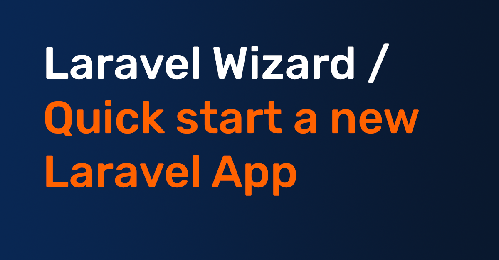

# Create laravel project

Start a fresh laravel project in a few minutes with this laravel install wizard.

- Select laravel version
- Select Starterkit
- Configure Starterkit
- Configure additional features you mostly want/need in your new project
- Configure Assets

## Documentation

Documentation is available at [Github Pages](https://boonweb.github.io/create-laravel-project-docs/)

## Changelog

The [CHANGELOG.md](CHANGELOG.md) file contains all versions and links their changes.

## Contributing

Please see [CONTRIBUTING.md](CONTRIBUTING.md) for details.

## Credits

- [All Contributors](CONTRIBUTORS.md)

## License

The GNU GPL v3 License (GNU). Please see [License File](LICENSE) for more information.
